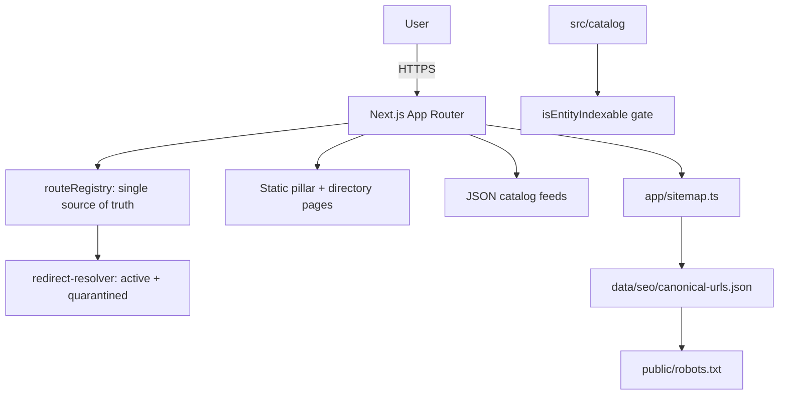

# BestAIAgent.in

> Evidence-led discovery and comparison for public AI agents, models, providers, and MCP tooling.

[](https://github.com/CodesbyFebin/Best-Ai-Agents/actions/workflows/ci.yml)
[](#license)
[](https://nodejs.org)
[](https://nextjs.org)

**BestAIAgent.in** helps you compare AI agents by the job you need done, the
evidence vendors publish, deployment and integration constraints, and
India-specific buying context — then verify capabilities and commercial terms
using the source links shown beside each product.

- 🌐 Live site: <https://bestaiagent.in>
- 📖 Machine-readable index: <https://bestaiagent.in/llms.txt>
- 📊 Structured catalogs: `/catalog.json`, `/models.json`, `/agents.json`, `/providers.json`

---

## Why BestAIAgent.in?

Most "AI agent" lists rank by vibes. BestAIAgent.in does the opposite:

1. **Match intent first** — compare products that solve the same user job
   (coding, automation, business, research, voice, frameworks) before crossing
   categories.
2. **Verify claims** — prefer official product, documentation, and pricing
   sources, each with a review date.
3. **Expose uncertainty** — incomplete evidence is never turned into a universal
   winner or a fabricated score.
4. **Refresh** — material product, pricing, availability, and integration facts
   are rechecked as they change.

This verification-first methodology is the product. It is enforced in code
(`src/catalog/verification.ts`) and documented in
[`/methodology`](https://bestaiagent.in/methodology).

## Features

| Capability | Status | Notes |
| --- | --- | --- |
| Agent / model / provider directories | ✅ | `/agents`, `/models`, `/providers`, `/categories` |
| Pillar buyer-guides | ✅ | `/best-ai-agent`, `/best-ai-agent-for-coding`, … |
| Side-by-side comparison | ✅ | `/compare` |
| MCP / tooling discovery | ✅ | `/mcp`, server references |
| Evidence-linked methodology | ✅ | every claim carries a source + review date |
| Machine-readable feeds | ✅ | JSON catalogs + `llms.txt` |
| Canonical URL / redirect governance | ✅ | `data/seo/*`, `src/routing/*` |
| Published entity cards | 🟡 | gated by verification; ships empty until data is verified |

> ✅ = present and verified from source. 🟡 = implemented but intentionally
> conservative (no unverified data published).

## Quick start

```bash
# Requires Node.js >= 22.13
npm install
npm run dev          # local dev server
npm run build        # production build
npm start            # serve the production build
npm test             # vitest unit tests
npm run verify:all   # typecheck + full SEO/route/pillar gate chain
```

## Architecture



- **Routing** — `src/routing/routeRegistry.ts` is the single source of truth;
  `app/sitemap.ts` and `scripts/seo/build-canonical-db.ts` derive from it.
- **SEO governance** — `scripts/seo/*` generate the canonical URL database,
  redirect map, sitemap, and recovery reports. `verify:*` scripts are the
  acceptance gates.
- **Data integrity** — `src/catalog/verification.ts` refuses to publish any
  entity that is not verified with first-party evidence.

See [`docs/architecture.md`](docs/architecture.md) for the full diagram and
request/agent/data flows.

## Documentation

| Resource | Purpose |
| --- | --- |
| [`docs/architecture.md`](docs/architecture.md) | System architecture & data flow |
| [`docs/getting-started/`](docs/getting-started/) | Install, quickstart, first contribution |
| [`/methodology`](https://bestaiagent.in/methodology) | Verification policy (live) |
| [`/llms.txt`](https://bestaiagent.in/llms.txt) | AI-search friendly index |

## Repository presentation

This repository follows an evidence-first presentation standard:

- No fabricated benchmarks, ratings, stars, or adoption claims.
- Every product claim links to verifiable first-party evidence.
- Community-health files (`CONTRIBUTING`, `CODE_OF_CONDUCT`, `SECURITY`, …)
  are provided for genuine contributor onboarding.

## Contributing

Contributions are welcome. Read
[`CONTRIBUTING.md`](CONTRIBUTING.md) first — it covers the dev loop, the
verification policy, and how to add or correct catalog evidence.

## Security

Found a vulnerability? **Do not open a public issue.** Follow
[`SECURITY.md`](SECURITY.md) and report privately.

## License

A license has not yet been selected for this repository. See
[`GOVERNANCE.md`](GOVERNANCE.md) for the current status. Code is provided
"as is" until a license is added.

---

<p align="center">
  <sub>BestAIAgent.in — compare agents by evidence, not by hype.</sub>
</p>
