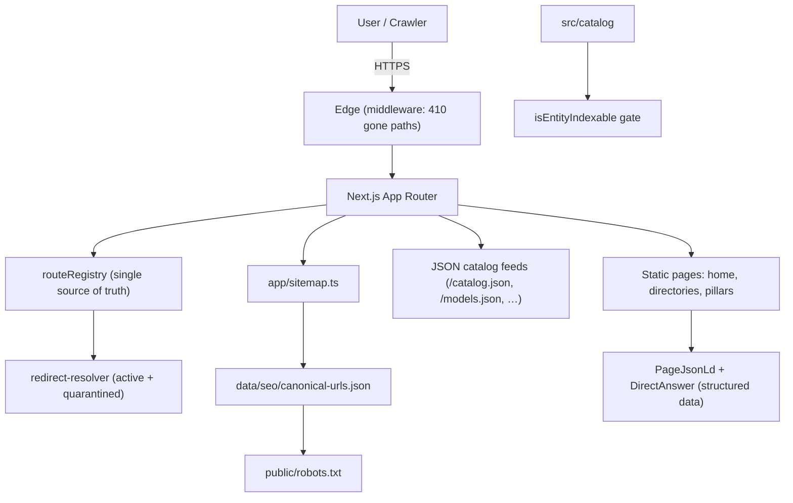
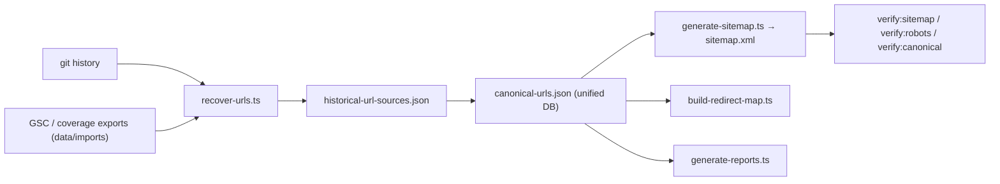

# Architecture

BestAIAgent.in is a Next.js (App Router) application that serves an
**evidence-led discovery and comparison directory** for public AI agents, models,
providers, and MCP tooling. It is a static, server-rendered site — it does not
build or run agents itself.

## High-level flow

## Routing

`src/routing/routeRegistry.ts` is the **single source of truth** for routes. Both
`app/sitemap.ts` (runtime) and `scripts/seo/build-canonical-db.ts` (canonical DB
generation) derive from it, so the sitemap, the canonical URL database, and the
redirect map cannot drift apart.

- `redirect-resolver.ts` resolves active legacy redirects (e.g.
  `/best-ai-agents` → `/best-ai-agent`) and keeps "quarantined" redirects
  inactive so the runtime never redirects a user to a 404.
- `path-normalization.ts` canonicalizes paths (no trailing slash, no duplicate
  slashes, no query/fragment).

## SEO governance

The `scripts/seo/*` pipeline is deterministic and gated by `verify:*` scripts
(also run in CI). Every URL carries provenance; URLs with no current equivalent
route are classified `GONE` (served as 410 by middleware).

## Data integrity

`src/catalog/verification.ts` defines `isEntityIndexable()`, which requires an
entity to be `published`, `verified`, and backed by evidence of an allowed
source type. This is what keeps the directory honest: no unverified data is
published, and no summary score is invented.

## Request → response

1. A request arrives at the edge. `middleware.ts` returns `410` for any path in
   the `GONE` set.
2. The App Router resolves the route from `routeRegistry`.
3. Pages render server-side with structured data (`PageJsonLd`, `DirectAnswer`)
   and evidence-linked content from `src/data/pillars.ts`.
4. `app/sitemap.ts` and `public/robots.txt` expose the canonical surface to
   crawlers.

## What this project is **not**

- It is **not** an agent framework or runtime.
- It does **not** execute tools, call models, or store user data.
- It does **not** assign ratings/scores; it surfaces verifiable evidence.
